# Setup Documentation
## Setting Up My Developer Environment

# Tasks

# 1. OPerating System

I am using Ubuntu operating system for this development environment setup.

## Version
 
 To check the OS version, I ran this command: lsb_release -a
 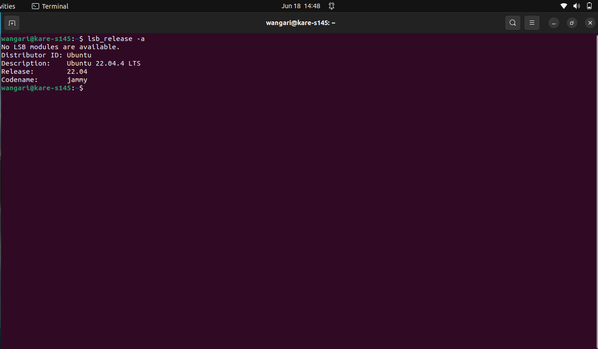

## Additional Setup

 I ensured my system is up-to-date by running the following commands:
    > sudo apt update
    > sudo apt upgrade

Ubuntu uses "apt" as its package manager, which I will use to download necessary software.

# 2. Integrated Development Environment (IDE)

The default text editor in my OS is geddit but I prefer Visual Studio Code.

## Download
The download page: 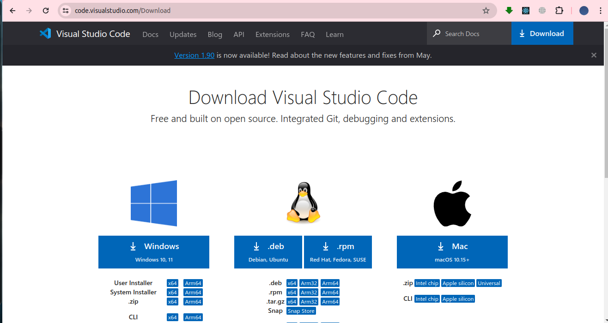
I navigated to this link  , and followed the guidelines to downloas VS Code for Linux.

Here is a screenshot of VS Code: 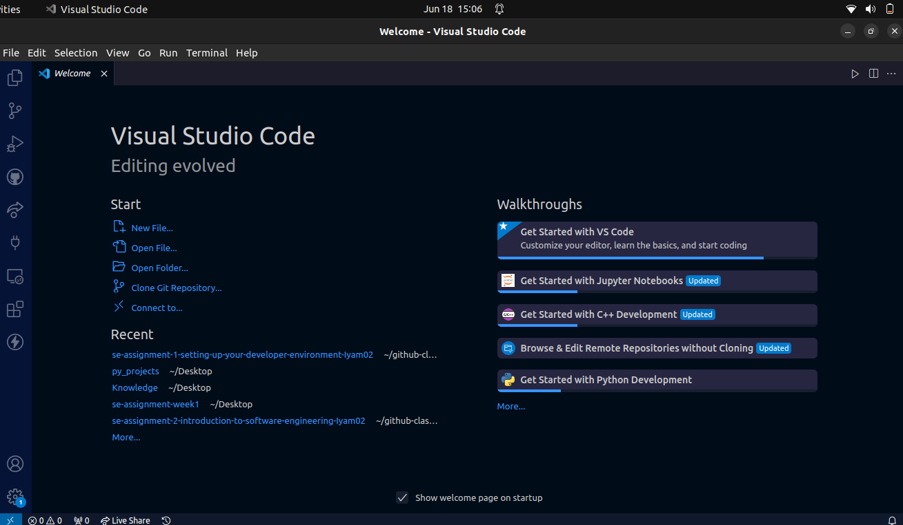 ,to verify a successful download.

# 3. Version Control System

Since I'm using Ubuntu, I already have access to a powerful terminal interface that includes basic version control capabilities. 
I'm well accustomed to using the terminal.

The following are steps of how I will initialize a Git repository without installing Git:

## I. First, Creating a Github Account

Github profile: 
                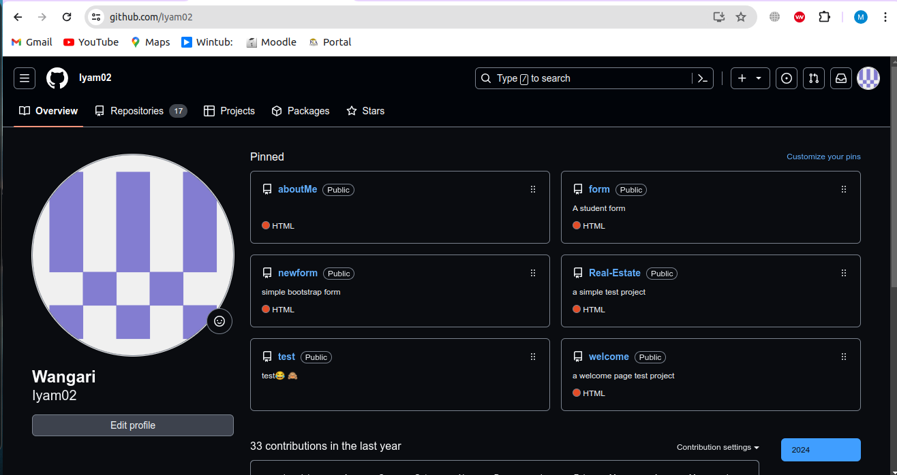

## II. Initialize a Git Repository
I'll navigate to my terminal, create a new folder and use built in version control control commands to set up my repo.

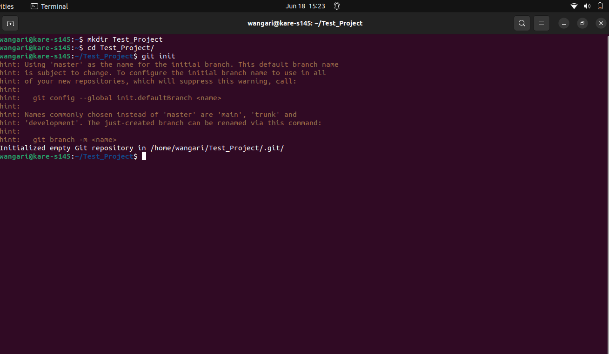

## III. Add a README File, staging the changes and making my first commit directly through the terminal.

By using the terminal for version control, I can manage my project's history and work effectively without the need to install additional software like Git.

## IV. Adding the folder to Github

I navigated back to my Visual Studio Code Terminal to push my work to a Github repository named Sample_Project 

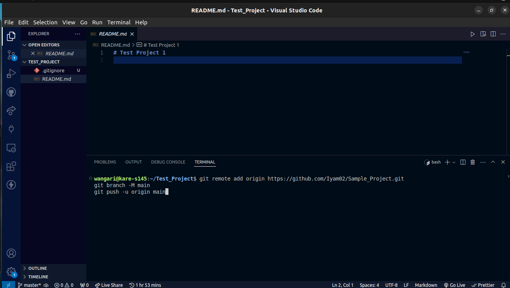
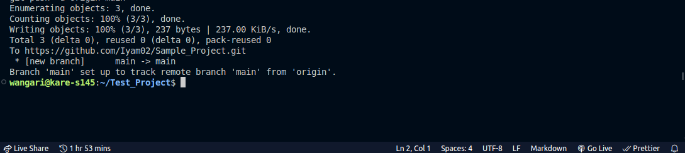

Here's proof of a successful push to my GitHub account: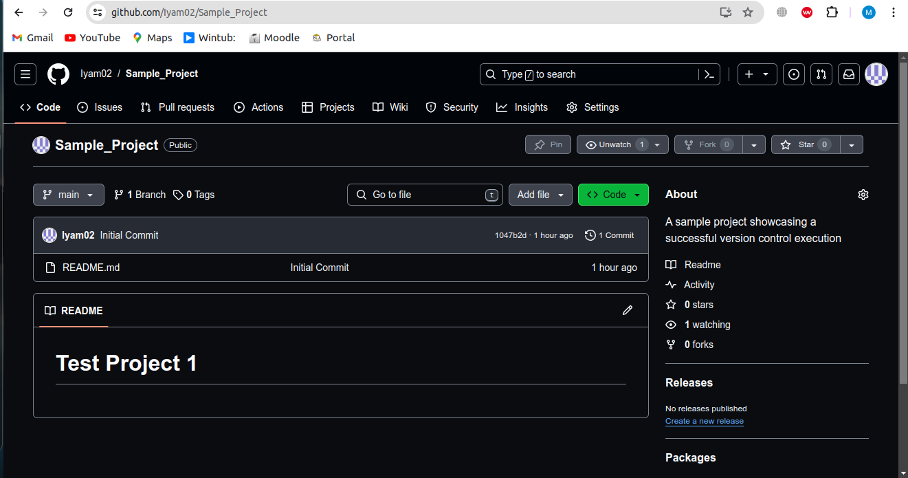

# 4. Install Necessary Programming Languages and Runtimes:

Since I'm using Ubuntu, Python is often pre-installed, so I can verify its installation directly from the terminal without downloading it from the website. 
Here is how I'll do it:

## 1. Check Python Version

I'll use this command: "python3 --version" to display the installed Python version.

Verification: 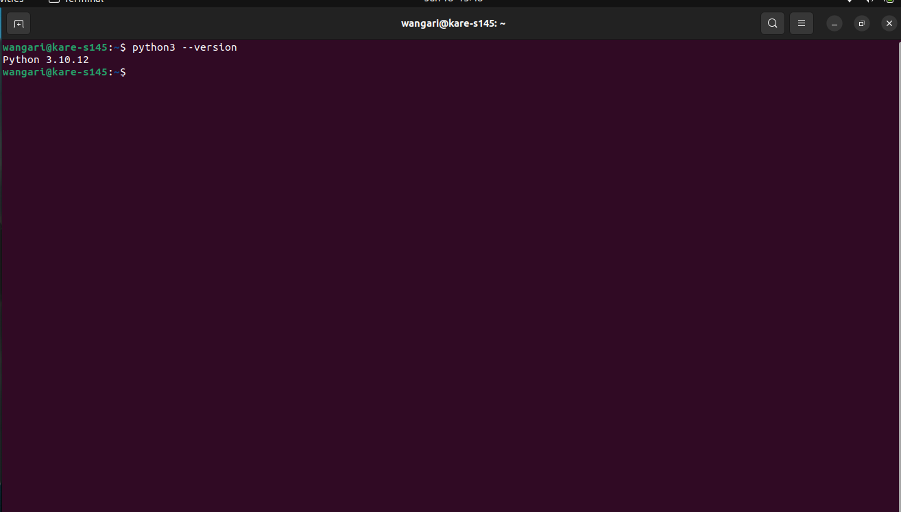

# 5. Package Managers

I installed PIP, Python Package Manager, from my terminal using this command "sudo apt install python3-pip"

Check PIP version: "pip --version"

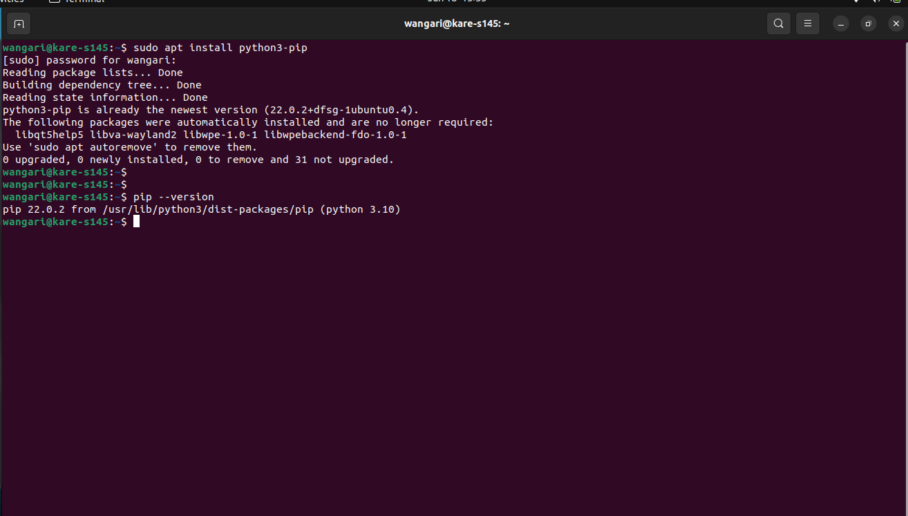

# 6. Database Configuration (MySQL)

I had previsouly downloaded MySQL, I visited https://dev.mysql.com/downloads/workbench/, followed the steps and I successfully downloaded MySQL workbench 
 

MySQL: 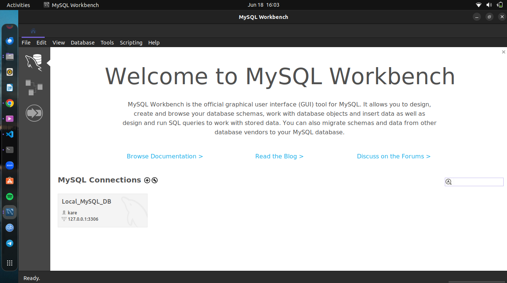

### For Step 7, I will revisit it later on after obtaining comprehensive details to facilitate informed execution.

# 8. Extensions and Plugins

I currently have 57 extensions within my Visual Studio COde environment. Each serving a distinct purpose, ranging from enhancing code readability and productivity through features such as code formatting, syntax highlighting and themes. 

List of the extensions installed: 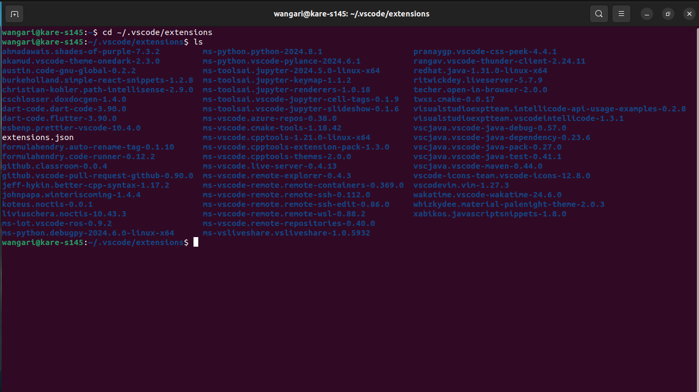

#  Reflection on Challenges

Reflecting on the challenges encountered during the installation process, it's evident that navigating the intricacies of Ubuntu Linux posed both frustrations and moments of intrigue. I resorted to the tried-and-tested method of seeking assistance online, often copy-pasting error messages in pursuit of solutions. I was able to find solutions, most of the time. Stack Overflow really helped me out not forgeting some insightful tutorials on Youtube. The challenges helped me understand technical issues and how to troubleshoot effectively. Also I learnt the importance of online community and the resources they provide.

